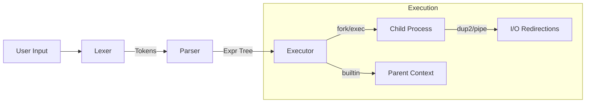
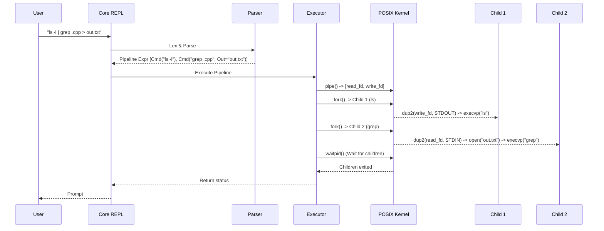

<div align="center">

# mysh

### A production-grade POSIX mini-shell

**Recursive-descent parsing · Job control · Redirections · Process pipelines**

[](https://github.com/bharqav/mysh/actions/workflows/ci.yml)
[](https://isocpp.org/)
[](LICENSE)
[](Dockerfile)

</div>

---

`mysh` is a POSIX-compatible mini-shell implemented in C++17. It demonstrates the core systems programming challenges behind Unix shells — lexical analysis, recursive-descent parsing, process lifecycle management (`fork`, `execvp`, `waitpid`), file descriptor manipulation (`pipe`, `dup2`), and background job control.

> **Why build this?** Building a shell from scratch is the ultimate test of understanding Unix process models. `mysh` acts as a clear, educational reference for how modern shells construct abstract syntax trees (ASTs) from raw input and evaluate them securely using system calls.

---

## Architecture

`mysh` is modular, separating the interpretation pipeline into clear stages.



### Modules

| Component | Responsibility |
|-----------|----------------|
| **`lexer/`** | Tokenization, string expansion, environment variable substitution. |
| **`parser/`** | Recursive-descent AST construction with operator precedence (`&&`, `||`, `|`, `;`). |
| **`executor/`** | Traversing the AST, forking processes, plumbing pipes, remapping file descriptors. |
| **`builtins/`** | Native command execution requiring parent context access (e.g., `cd`, `export`). |
| **`core/`** | REPL lifecycle, prompt rendering, global state management. |

### Process & Data Flow



---

## Key Features

- **Pipes and Redirections:** Compose processes seamlessly using `|`, `<`, `>`, `>>`, and heredocs `<<`.
- **Logical Grouping:** Chain conditions with `&&`, `||`, and `;`, respecting precise execution precedence.
- **Subshells:** Isolate environment changes using parentheses `( command )`.
- **Job Control:** Send jobs to the background with `&`, manage them using `jobs`, `fg`, and `bg`.
- **Core Builtins:** Native implementations for `cd`, `pwd`, `echo`, `export`, `unset`, `env`, `exit`, and `help`.
- **Robust Parsing:** A true recursive-descent parser building a structured AST, gracefully catching syntax errors.
- **Environment Expansion:** Dynamic variable expansion (`$VAR`) during lexing.

---

## Quick Start

### Local Build (POSIX-compliant systems)

**Prerequisites:**
- Linux, macOS, or WSL
- `g++` (C++17) or `clang++`
- `make`
- (Optional) `libreadline-dev` for command history

```bash
git clone https://github.com/bharqav/mysh.git
cd mysh

# Compile
make

# Run interactively
./mysh
```

### Docker

If you prefer an isolated environment:

```bash
docker build -t mysh .
docker run -it --rm mysh
```

---

## Usage Examples

```bash
# Standard Unix commands and pipelines
mysh> ls -la | grep "cpp" | wc -l

# Background jobs
mysh> sleep 10 &
[1] 34912
mysh> jobs
[1] + Running        sleep 10 &
mysh> fg 1

# Environment expansion and logical operators
mysh> export TARGET="build"
mysh> mkdir $TARGET && cd $TARGET || echo "Failed"

# I/O Redirection
mysh> echo "hello" > test.txt
mysh> cat < test.txt >> output.log
```

---

## Development and Testing

`mysh` features a robust test suite spanning unit tests, integration smoke tests, edge cases, and memory sanitization.

```bash
# Run unit tests (Lexer/Parser/AST logic)
make unit

# Run end-to-end smoke tests (invokes shell and validates stdout/stderr)
make test

# Run exhaustive regression tests
make regression

# Run with AddressSanitizer/UBsanitizer
make asan-check

# Run the complete CI pipeline locally
make check
```

---

## Documentation

For a deeper dive into the shell's internals, see our documentation:
- **[Architecture](docs/architecture.md)** — Detailed AST and parser design.
- **[Operations](docs/operations.md)** — Internal shell state management.
- **[Benchmarking](docs/benchmarking.md)** — Performance evaluation and testing metrics.

---

## Security

`mysh` is intended for educational purposes and internal use. 
- Do **not** use `mysh` as an interactive shell for the `root` user or in untrusted multi-user environments. 
- See [SECURITY.md](SECURITY.md) for more details.

---

## Contributing

Contributions are welcome! Please read [CONTRIBUTING.md](CONTRIBUTING.md) and [CODE_OF_CONDUCT.md](CODE_OF_CONDUCT.md) before submitting a Pull Request. Use `make lint` to verify code style before committing.

---

## License

This project is licensed under the MIT License — see the [LICENSE](LICENSE) file for details.
